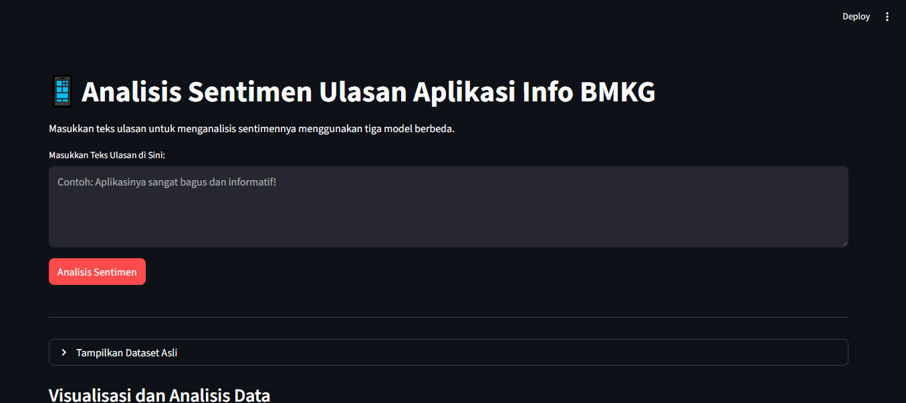
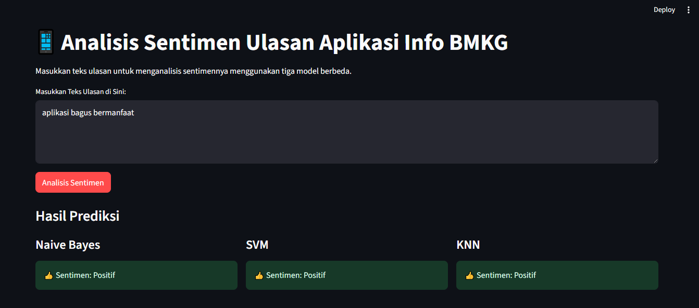
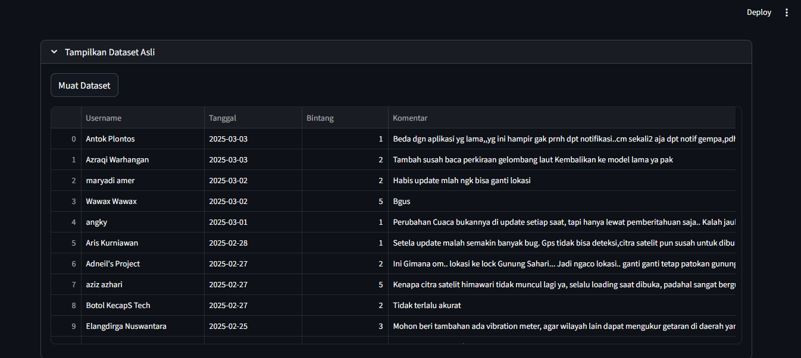
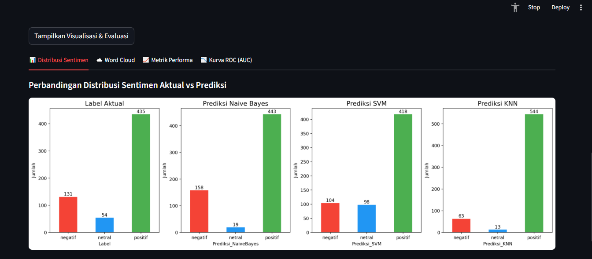
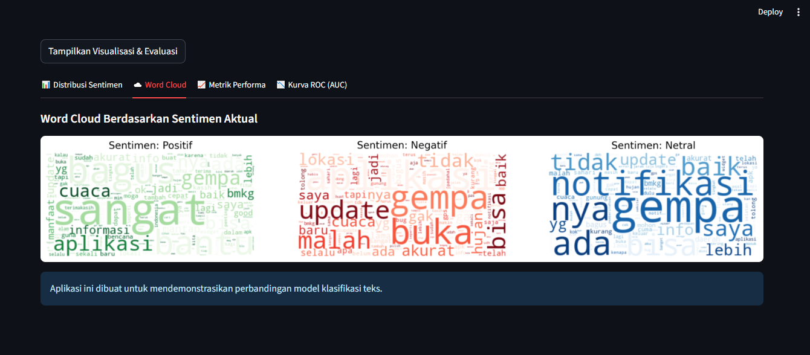

# Info BMKG App Review Sentiment Analysis


An interactive web application built using Streamlit to analyze user review sentiments for the "Info BMKG" mobile application. This app compares the performance of three machine learning classification models: **Naive Bayes**, **Support Vector Machine (SVM)**, and **K-Nearest Neighbors (KNN)**.

### App Demo






## Description

This project aims to classify sentiment (positive, negative, or neutral) from text reviews provided by users of the Info BMKG app on the Google Play Store. Utilizing pre-trained models, this application provides a platform to:
1. Perform real-time sentiment prediction on new, custom text.
2. Evaluate and compare the performance of three popular classification models side-by-side.
3. Provide informative data visualizations for deeper analysis.

## Key Features

- **Real-Time Sentiment Prediction**: Enter any review text and get instant sentiment predictions from all three models simultaneously.
- **Model Comparison**: View and compare results from Naive Bayes, SVM, and KNN side-by-side.
- **Dataset Viewer**: Load and inspect the original dataset used in this project.
- **Visualization & Evaluation Dashboard**:
  - **Sentiment Distribution**: Bar charts comparing the distribution of sentiments (positive, negative, neutral) between the original ground-truth labels and each model's predictions.
  - **Word Cloud**: Visualizations of the most frequently occurring words for each sentiment category.
  - **Performance Metrics**: A summary table of model performance metrics including **Accuracy, Precision, Recall, and F1-Score**.
  - **Confusion Matrix**: Visualized confusion matrices for each model to inspect detailed classification performance.
  - **ROC Curve (AUC)**: ROC curve graphs to evaluate the models' discrimination capabilities.

## Project Structure
```
sentiment_analysis_app/
├── streamlit_app.py              # Main application code
├── Model/
│   ├── naive_bayes_custom_model.pkl
│   ├── svm_custom_model_multi.json
│   └── knn_model.pkl
├── Dataset/
│   ├── 1 Dataset Asli.csv        # Original Dataset
│   └── 6 hasil_gabungan_prediksi.csv  # Combined Prediction Results
├── requirements.txt              # Required libraries list
└── README.md                     # This file
```

## Installation and Setup

Follow these steps to set up and run this application on your local machine.

### Prerequisites
- Python 3.8 or newer
- pip (Python Package Installer)

### Installation Steps

1. **Clone the Repository**
   Open your terminal or command prompt and clone this repository:
   ```bash
   git clone https://github.com/Lucifwr233/Aplikasi-Sentimen-InfoBMKG-Streamlit.git
   ```

2. **Navigate to the Project Directory**
   ```bash
   cd Aplikasi-Sentimen-InfoBMKG-Streamlit
   ```

3. **Install Dependencies**
   Install all the required libraries using the `requirements.txt` file:
   ```bash
   pip install -r requirements.txt
   ```

4. **Run the Streamlit App**
   Once the installation is complete, launch the application with the following command:
   ```bash
   streamlit run streamlit_app.py
   ```
   The application will automatically open in your default web browser.

## Models Used

- **Naive Bayes**: A probabilistic classification algorithm based on Bayes' Theorem. It is fast, simple, and performs remarkably well for text classification tasks.
- **Support Vector Machine (SVM)**: A model that finds the optimal *hyperplane* to separate data into distinct classes. It is highly effective in high-dimensional spaces.
- **K-Nearest Neighbors (KNN)**: An *instance-based learning* algorithm that classifies a new data point based on the majority class of its 'k' nearest neighbors.
